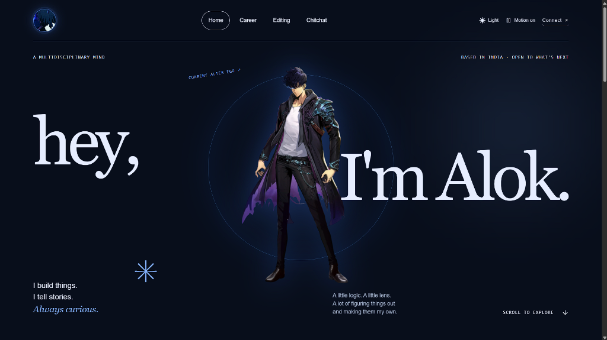
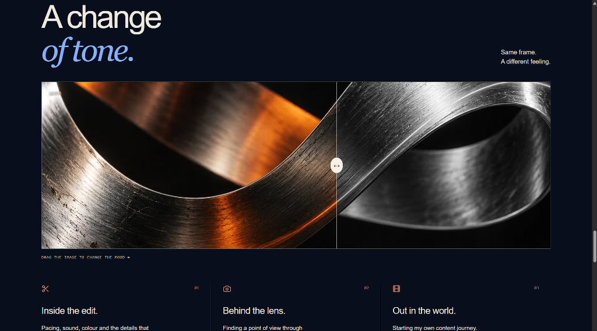

# Alok Patel — Solo Leveling Themed Portfolio

A highly stylized, dark-mode-first personal portfolio heavily inspired by the aesthetics of the anime/manhwa *Solo Leveling*. It features deep midnight blues, vibrant glowing accents, fluid GSAP animations, and immersive 3D parallax effects.

## Visuals

Here is a glimpse of the portfolio's Solo Leveling inspired design:

### The Hero Section

*Features a 3D parallax mouse-tracking effect on the Sung Jinwoo character, with custom typography and glowing "Solo Leveling" themed buttons.*

### The Storyteller (Video Editing)

*Interactive color-tone slider (Warm to Mono) and custom video reel sections.*

## Features

- **Solo Leveling Aesthetic**: Built around a dark-mode core (`data-theme="dark"`) with glowing blue and purple accents, drop shadows, and sharp contrasting borders.
- **Immersive GSAP Animations**: Custom scroll-triggered animations, page transition rift effects (burning red/blue), and ambient floating particles.
- **3D Mouse Tracking**: The main hero character follows your cursor in a subtle 3D parallax tilt.
- **Four Distinct Worlds**: Home, Career (The Builder), Editing (The Storyteller), and Chitchat (Contact).
- **Interactive UI Elements**: Custom image comparison sliders, animated orbit rings for skills, and a fully functional FormSubmit contact popup.

## Tech Stack

- **Framework**: React / Next.js-compatible Vinext
- **Styling**: Tailwind CSS v4, Custom CSS variables
- **Motion**: GSAP (GreenSock), Radix UI primitives
- **Icons**: Lucide React

## Run locally

Install Node.js 22.13 or newer and pnpm 11.25.0. From this folder:

```sh
pnpm install
pnpm build
pnpm start
```

*Note: The framework runner supports the bundled Cloudflare configuration. Run `pnpm start` to preview the built Worker locally on port 8787.*
